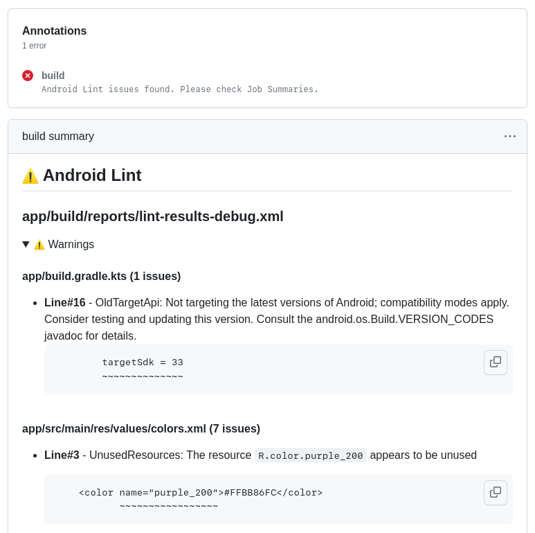

# action-report-android-lint

[](https://github.com/hidakatsuya/action-report-android-lint/actions/workflows/test.yml)

A GitHub Action to check and report the results of Android Lint in Job Summaries.



See also [Job Summaries for unit-test workflow results](https://github.com/hidakatsuya/action-report-android-lint/actions/workflows/test.yml).

## Usage

```yaml
  - name: Lint
    run: ./gradlew lint

  - name: Check and report lint results
    uses: hidakatsuya/action-report-android-lint@v1.1.3
    with:
      result-path: 'app/build/reports/lint-results-debug.xml'
```

Alternatively, you can specify a major version, such as `hidakatsuya/action-report-android-lint@v1`.

### result-path

Indicates the relative path from the working directory to Android Lint result XML file.
Path patterns by [@actions/glob](https://www.npmjs.com/package/@actions/glob) can also be specified.

### fail-on-warning (optional)

Indicates whether the action should fail if there is a severity warning issue. Default is `true`.

### follow-symbolic-links (optional)

Indicates whether symbolic links are followed in searching XML files. Default is `true`.

## Versioning

This action follows [the recommendations of GitHub Actions Versioning](https://github.com/actions/toolkit/blob/master/docs/action-versioning.md).

## Releasing

1. Make sure CI for main branch has passed
2. Create a new release to publish to the GitHub Marketplace
3. Make sure that [the release workflow](https://github.com/hidakatsuya/action-report-android-lint/actions/workflows/release.yml) has passed
